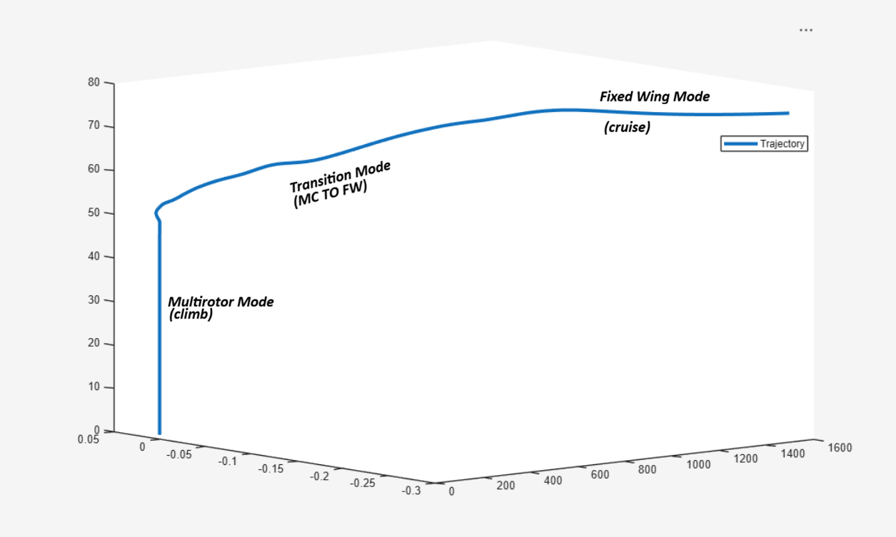
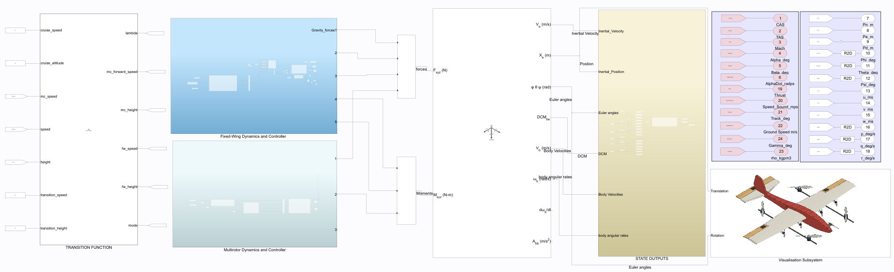
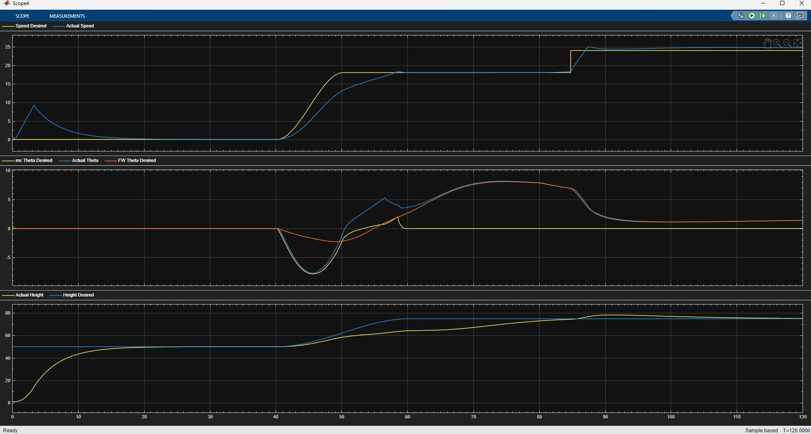

# VTOL Quadplane: Flight Dynamics, Control & Transition Simulation

A MATLAB/Simulink model of a **VTOL quadplane**: a fixed-wing aircraft with four lift rotors for vertical flight and a rear pusher motor for forward flight. The model covers the whole mission in closed loop:

**vertical take-off (multirotor mode) → hover → transition (MC → FW) → fixed-wing cruise**

It combines a nonlinear 6-DOF rigid-body model, propulsion built from measured motor bench-test data, separate multirotor and fixed-wing controllers, and a **mode manager** that blends control authority smoothly between the two flight modes.

<p align="center">
  
</p>

---

## Model overview

<p align="center">
  
</p>

| Subsystem | Description |
|---|---|
| **Transition Function** (mode manager) | A state machine that produces the mode, the blending factor **λ**, and the height and speed commands for each controller (see below). |
| **Multirotor Dynamics & Controller** | Quad velocity controller (forward speed → pitch command) and height controller. A cascaded attitude controller (roll, pitch and yaw angle → rate PID loops) feeds the **motor mixer** (throttle, roll, pitch and yaw → 4 rotor commands). Rotor throttle is mapped to RPM using the measured data, then turned into thrust and torque (`c_T·Ω²`, `c_M·Ω²`) using the quad-X arm geometry. |
| **Fixed-Wing Dynamics & Controller** | Aerodynamic forces and moments from stability and control derivatives (CL, CD, CY, Cl, Cm, Cn, including α̇ and rate terms), and pusher thrust and torque interpolated from the measured data. The autopilot is a successive-loop-closure design (Beard & McLain): pitch-attitude hold on the elevator, altitude and airspeed loops, and course/roll on the aileron. |
| **Gravity forces** | Gravity rotated into the body frame through the DCM. |
| **6-DOF (Euler Angles)** | Aerospace Blockset rigid-body equations of motion. |
| **State Outputs** | ISA atmosphere model and air data: TAS, CAS, Mach, α, β, α̇, flight-path angle, track, ground speed and density. |
| **Visualisation Subsystem** | 3-D animation of the quadplane using the Simulation 3D UAV Vehicle block. |

### Force & moment blending

The two propulsion and aero paths are combined using the transition factor λ ∈ [0, 1]:

```
F_total = F_gravity + λ·(F_aero + F_pusher) + (1 − λ)·F_rotors
M_total =             λ·(M_aero + M_pusher) + (1 − λ)·M_rotors
```

The multirotor attitude-controller command is also scaled by (1 − λ). As the aircraft speeds up, authority passes smoothly from the rotors to the wing, with no switching transients.

### Mission state machine

| Mode | Phase | Behaviour |
|---|---|---|
| 0 | **Climb** | Multirotor climbs vertically to the transition height |
| 1 | **Hover** | Holds the transition height briefly before transitioning |
| 2 | **Transition** | λ ramps from 0 to 1. The forward-speed and altitude targets ramp with *smoothstep* profiles, so no controller sees a step input or derivative kick. |
| 3 | **Fixed-wing cruise** | Entered once λ = 1, cruise altitude is reached, and speed ≥ transition speed. Holds cruise speed and altitude. |

Default mission set-up (top-level constants):

| Parameter | Value |
|---|---|
| Transition height | 50 m |
| Transition speed | 18 m/s |
| Cruise altitude | 75 m |
| Cruise speed | 24 m/s |

---

## Results

<p align="center">
  
</p>

The three panels show:
- **Top: airspeed.** The speed stays near zero through the climb and hover. During transition it follows the ramped 18 m/s target, then steps up to the 24 m/s cruise speed.
- **Middle: pitch.** The aircraft pitches nose-down under multirotor control to accelerate forward. Pitch then hands over to the fixed-wing pitch command as λ → 1.
- **Bottom: height.** The aircraft climbs vertically to 50 m, rises to 75 m during transition, and settles at the cruise altitude.

---

## Propulsion data

Both propulsion systems use **measured T-Motor bench-test data**, stored as lookup tables and interpolated against throttle:

| Role | Motor | Propeller | Data file |
|---|---|---|---|
| Lift rotors (×4) | T-Motor MN701S 135KV | G26×8.5 | `propulsion/QUAD_PROP_DATA.xlsx` |
| Pusher motor | T-Motor AT4130 Long Shaft 450KV | APC 18×8 | `propulsion/FIXED_WING_PROP_DATA.xlsx` |

Each table has throttle, voltage, current, power, RPM, torque, thrust and efficiency columns. Thrust is converted from grams to newtons when the data is loaded.

---

## Repository structure

```
├── VTOL_quadplane.slx              # Main Simulink model
├── Initalise_Simulink.m            # Run first – loads params, propulsion data, trim, builds bus
├── Params1.m                       # Airframe geometry, mass/inertia & aero derivatives
│
├── propulsion/
│   ├── FW_propulsion_data.m        # Loads pusher-motor lookup table → params.fw
│   ├── Quad_propulsion_data.m      # Loads lift-motor lookup table   → params.quad
│   ├── FIXED_WING_PROP_DATA.xlsx
│   └── QUAD_PROP_DATA.xlsx
│
├── trim/
│   ├── Main_logitudinal_wings_level_trim_24ms_act.mat   # Wings-level cruise trim @ 24 m/s
│   └── hover_trim.mat                                   # Multirotor hover trim
│
└── images/
```

---

## Requirements

- **MATLAB & Simulink R2026a** (the model was saved in R2026a)
- **Aerospace Blockset**, for the 6-DOF (Euler Angles) block and the ISA atmosphere
- **Simulink Control Design**, used to generate the trim operating points (`op_trim1`)
- **UAV Toolbox**, only for the 3-D visualisation (Simulation 3D blocks, Windows only). You can comment out the *Visualisation Subsystem* to run without it.

---

## Running the simulation

1. Clone the repository and open MATLAB in the repo folder.
2. Run the initialisation script:
   ```matlab
   >> Initalise_Simulink
   ```
   This script:
   - adds the sub-folders to the path
   - loads the airframe parameters (`Params1`) and both propulsion lookup tables
   - loads the cruise and hover trim points into `params.trim_States` and `params.trim_Inputs`
   - creates the `params` Simulink bus object
3. Open `VTOL_quadplane.slx` and press **Run**. The default stop time is 120 s.
4. Use the scopes to check speed, pitch and height tracking, and the state outputs to see the full set of states and air data.

To change the mission, edit the constants feeding the **Transition Function** block (cruise speed, cruise altitude, transition speed and transition height). Altitudes are entered as NED *down* values, so 50 m altitude is `-50`. To start from a different trim point, change the `trim_data = load(...)` line in `Initalise_Simulink.m`.

---

## Assumptions & limitations

- Rigid body with constant mass and inertia
- No rotor–wing aerodynamic interaction, and no rotor inflow effects in forward flight
- Rotor thrust and torque come from static bench-test data, so advance-ratio effects are ignored
- Ideal sensors with full-state feedback (no estimator)
- Calm air by default (wind inputs are available but set to zero)

## Future work

- Back-transition (FW → MC) and vertical landing
- Wind and gust disturbance rejection
- Sensor models and state estimation
- Waypoint guidance in fixed-wing cruise
- Hardware-in-the-loop testing with PX4 / ArduPilot

---

## References

- R. W. Beard and T. W. McLain, *Small Unmanned Aircraft: Theory and Practice*, Princeton University Press, 2012.
- B. L. Stevens, F. L. Lewis and E. N. Johnson, *Aircraft Control and Simulation*, Wiley, 2015.
- T-Motor AT4130 and MN701S product datasheets (propulsion bench-test data).

## Author

**Aliasgar Malik**, MSc Aerial Robotics (University of Bristol & UWE)
